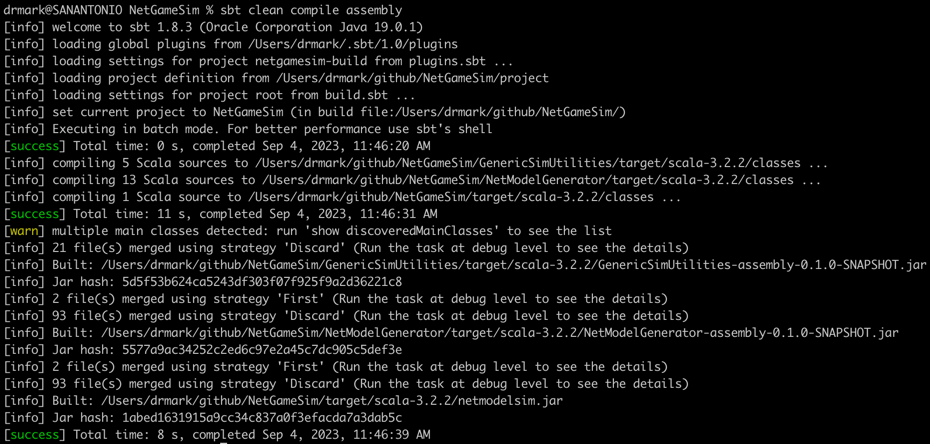

Network Graph Simulation (NetGameSim) Experimental Platform
=======================
#### The goal of this experimental plaform is to allow users to generate large-scale random graphs and to create random perturbations of these graphs with precise records of what nodes and edges were perturbed. The toolkit allows the users to perform random walks on the graphs with the cost model for exploring the graph with these random walks. The functionality of this platform includes various algorithms on the graphs, graph visualization, walk cost models and (de)serialization of the generated graphs and the perturbed graphs deltas, i.e., the differences between a generated graphs and its perturbed counterpart. 

This is an image of the generated graph with 300 nodes.

Overview
---
* NetGameSim uses [Google's Guava](https://github.com/google/guava) and [JGraphT](https://github.com/jgrapht/jgrapht) libraries for graph manipulations;
* [Scalatest](https://github.com/scalatest/) dependency is used for testing;
* [Typesafe configuration](https://github.com/lightbend/config#readme) dependency is used to manage configuration options in [application.conf](GenericSimUtilities/src/main/resources/application.conf);
* [Logback classic](https://mvnrepository.com/artifact/ch.qos.logback/logback-classic) dependency is used for logging;
* For visualization NetGameSim uses [GraphViz](https://graphviz.org/download/) package that should be installed independently;
* NetGameSim also uses a [visualization library](https://github.com/nidi3/graphviz-java) for invoking GraphViz programmatically;
* NetGameSim takes only one command-line parameter, i.e., the name of the output file that is used to serialize a generated graph and its perturbed equivalent as well as GraphViz visualization files;
* Each generated graph contains an extra node that is called the ***initial node***, since it may be convenient for certain type of analyses to assume an existing entry point for a simulated system;
* Scala parallel collection is used to parallelize graph generation and it achieves 10x speedup on multicore processor computers; it's recommended to use at least a Quad-core CPU with a minimum of 8 GB of RAM;
* NetGameSim has been tested with Scala 3.x and the JVM 1.8 to 19. As an IntelliJ project it can be loaded and built within the IDE.
* To build NetGameSim from the command line [SBT](https://www.scala-sbt.org/release/docs/Setup.html), [Scala](https://www.scala-lang.org/download/) and a [JDK/JVM](https://docs.oracle.com/en/java/javase/) should be installed and configured.
* External plugins for the IntelliJ IDE settings and for creating a jar file are specified in ```plugins.sbt``` under the sources root project and other plugins can be substituted as needed:
```scala
addSbtPlugin("org.jetbrains.scala" % "sbt-ide-settings" % "1.1.1")
addSbtPlugin("com.eed3si9n" % "sbt-assembly" % "2.1.0")
```

Installing, Compiling and Running NetGameSim 
===
* Once all prerequisites are met, clone [NetGameSim](https://github.com/0x1DOCD00D/NetGameSim) using the command ```git clone```;
* Once the repository is cloned, assuming its local path is the root directory ```/path/to/the/cloned/NetGameSim``` open a terminal window and switch to the directory ```cd /path/to/the/cloned/NetGameSim```;
* Build the project using the command ```sbt clean compile assembly``` that results in the executable file located under ```target/scala-3.2.2/netmodelsim.jar``` relative to the root directory.
* Alternatively, you can load the project into IntelliJ and compile and run it using the main entry point in [Main.scala](src/main/scala/Main.scala);
* You should make sure that the Java version that is used to compile this project matches the JVM version that is used to run the generated program jar from the command line, otherwise you may receive a variant of the following error message: "Exception in thread "main" java.lang.UnsupportedClassVersionError: org/jgrapht/Graph has been compiled by a more recent version of the Java Runtime (class file version 55.0), this version of the Java Runtime only recognizes class file versions up to 52.0." A quick check using the command ```java -version``` shows "openjdk version 1.8.0_292" meaning that we should switch to a higher version of the JVM. First, we check to see what JDKs are installed using the command ```/usr/libexec/java_home -V``` that outputs a list of versions like the following.
```shell
Matching Java Virtual Machines (6):
19.0.1 (x86_64) "Oracle Corporation" - "OpenJDK 19.0.1" /Users/drmark/Library/Java/JavaVirtualMachines/openjdk-19.0.1/Contents/Home
18.0.1.1 (x86_64) "Oracle Corporation" - "OpenJDK 18.0.1.1" /Users/drmark/Library/Java/JavaVirtualMachines/openjdk-18.0.1.1/Contents/Home
17.0.1 (x86_64) "Oracle Corporation" - "OpenJDK 17.0.1" /Users/drmark/Library/Java/JavaVirtualMachines/openjdk-17.0.1/Contents/Home
14.0.1 (x86_64) "Oracle Corporation" - "Java SE 14.0.1" /Library/Java/JavaVirtualMachines/jdk-14.0.1.jdk/Contents/Home
11.0.20.0-m1 (x86_64) "IBM Corporation" - "IBM Semeru Runtime Open Edition 11" /Users/drmark/Library/Java/JavaVirtualMachines/semeru-11.0.20/Contents/Home
1.8.0_292 (x86_64) "AdoptOpenJDK" - "AdoptOpenJDK 8" /Library/Java/JavaVirtualMachines/adoptopenjdk-8.jdk/Contents/Home
```
To choose a higher version of the JVM we execute the following command ```export JAVA_HOME=`/usr/libexec/java_home -v 19.0.1` ``` that resolves the issue.
* Once built you can execute the program using the following command ```java -Xms2G -Xmx30G -jar -DNGSimulator.NetModel.statesTotal=300  target/scala-3.2.2/netmodelsim.jar fileName``` where you can modify the memory allocation values for the command line arguments Xms and Xmx. 
* If ```fileName``` is omitted from the command line then the default name ```NetGraph_<time stamp>.ngs``` will be used;
* Configuration options in ```application.conf``` can be overwritten using the command line as it is shown with the option ```-D``` applied to the configuration option ```NGSimulator.NetModel.statesTotal```.

Running NetGameSim results in many log messages showing the progress of the execution and hopefully, if no error messages are shown then the last log entries can look like the following.
```log
11:51:08.894 [main] INFO  - Successfully persisted the graph to /Users/drmark/github/NetGameSim/outputs/Graph300Nodes.ngs.perturbed
11:51:08.894 [main] INFO  - Generating DOT file for graph with 287 nodes for visualization as /Users/drmark/github/NetGameSim/outputs/Graph300Nodes.ngs.perturbed.dot
11:51:08.938 [main] INFO  - Successfully rendered the graph to /Users/drmark/github/NetGameSim/outputs/Graph300Nodes.ngs.perturbed.dot
11:51:08.938 [main] INFO  - A graph image file for the perturbed graph can be generated using the following command: sfdp -x -Goverlap=scale -Tpng /Users/drmark/github/NetGameSim/outputs/Graph300Nodes.ngs.perturbed.dot > /Users/drmark/github/NetGameSim/outputs/Graph300Nodes.ngs.perturbed.png
11:51:08.941 [main] INFO  - 47 nodes and 138 edges have been perturbed
11:51:08.941 [main] INFO  - There are 15 modified nodes, 9 added nodes and 23 removed nodes.
11:51:08.941 [main] INFO  - There are 11 modified edges, 30 added edges and 97 removed edges.
11:51:08.945 [main] INFO  - Done! Please check the content of the output directory /Users/drmark/github/NetGameSim/outputs/
```
This last command is not run by NetGameSim intentionally. For large graphs it takes a while to generate its image and some users may avoid it altogether. Also, some parameters of the command ```sfdp``` may be different depending on the desired quality of the generated images and the capabilities of the computer used to generate images. This functionality is not critical for NetGameSim.

Building NetGameSim from the command line results in the following output that can vary depending on the versions of Java, Scala and Sbt used to compile the project and generate the assembly jar.


For more detailed code walkthru please watch this video.
[](http://www.youtube.com/watch?v=6fdazJBkdjA)

Configuration
========
All NetGameSim's configuration options are defined in [application.conf] under ```GenericSimUtilities/src/main/resources/application.conf``` where configuration option file for logging ```logback.xml``` is also located. Users can provide their own external ```application.conf``` to execute ```netmodelsim.jar``` from command line by using the JVM option ```-D``` as in [-Dconfig.file=path/to/config-file](https://github.com/lightbend/config).

Below if an example of the configuration file that contains the main configuration entry, ***NGSimulator*** that in turn contains two parameters and three configuration subentries.

```hocon
NGSimulator {
    seed = 100
    outputDirectory = "/Users/drmark/github/NetGameSim/outputs"
    NetModel {
        distanceSpreadThreshold = 0.05
        numberOfExperiments = 100
        perturbationCoefficient = 0.3
        dissimulationCoefficient = 0.15
        distanceCoefficient = 0.2
        edgeProbability = 0.001
        statesTotal = 100
        desiredReachabilityCoverage = 1.0
        numberOfWalks = 50
        maxBranchingFactor = 7
        maxDepth = 5
        maxProperties = 20
        propValueRange = 100
        actionType = 20
        actionRange = 10
        connectedness = 2
        maxWalkPathLengthCoeff = 2
        graphWalkTerminationPolicy = ${NGSimulator.Constants.MaxPathLength}
        graphWalkNodeTerminationProbability = 0.001d
    }
    CostRewards {
        Budget = 2700.0
        costOfDetection = 0.2d
        serviceRewardProbability = 0.3
        serviceReward = 10d
        servicePenalty = 3d
        targetNodeValue = 5
        targetNodeLowPenalty = 1
        targetNodeHighPenalty = 2
    }
    Constants {
       MaxPathLength  = "maxpathlength"
       UntilCycle = "untilcycle"
       All = "all"
    }
}
```
A typical accept/reject algorithm for simulation is based on the following simple algorithm. A threshold value, T is specified between zero and one. If a randomly generated value based on the uniform distribution within the same range, zero to one is less or equal to T then a desired random action is performed, e.g., adding a node to a random graph, o/w this action is discarded.
* The parameter, ***seed*** specifies the seed value for the random generator. Currently, ```java.util.concurrent.ThreadLocalRandom``` is used along with ```Random``` to take advantage of thread isolation to avoid the overhead associated with concurrency. As the documentation states, [the concurrent use of the same java.util.Random instance across threads may encounter contention and consequent poor performance](https://docs.oracle.com/javase/8/docs/api/java/util/Random.html). As a result this parameter is ignored in parallel graph generation and an additional parameter should be added to regulate the level of parallelism and reproducibility.
* The parameter ***outputDirectory*** specifies the path where output files are stored and it should be created before NetGameSim is run. Adding a file separator to the end of the path is optional.
* Configuration subentry, ***NetModel*** contains parameters that guide graph generation.
* The parameter ***distanceSpreadThreshold*** designates the desired threshold for the difference between the length of the max path from the ***initial node*** to the min path from the same node. This parameter is needed for certain types of simulations that involve path lengths.
* The parameter ***numberOfExperiments*** is used to specify how many experiments of some type to run automatically using this platform that collects the experimental data automatically. This functionality is still under development.
* The parameter ***edgeProbability*** specifies the probability that an edge can be added between a pair of nodes when constructing a random graph.
* The parameter ***perturbationCoefficient*** specifies the probability of modifying a graph element. 
* The parameter ***dissimulationCoefficient*** specify the probability that some parameters of the existing graph element may be modified.
* The parameter ***distanceCoefficient*** is used to determine to what graph nodes to apply perturbations. Suppose that the max distance is 5 and the distance coefficient is 0.2. Then the min distance to apply perturbation is 5*0.2 = 1.
* The parameter ***statesTotal*** specifies the number of nodes or states in a random graph.
* The parameter ***desiredReachabilityCoverage*** is a real number between zero and one that specifies the ratio of the nodes in the generated random graph that should be reached from the ***initial node***.
* The parameter ***numberOfWalks*** specifies the number of random walks to perform on the generated graph as part of each experiment.
* The parameters ***maxBranchingFactor***, ***maxDepth***, ***maxProperties***, ***propValueRange***, ***actionType*** and ***actionRange*** designate a representation of the organization tree for subcomponents of each generated node. In NetGameSim each node is abstracted as a tree representation of some internal organization, e.g., a file system for a computing node in a computer network.  
* The parameter ***connectedness*** specifies to how many other graph nodes the ***initial node*** should be connected by edges.
* The parameter ***maxWalkPathLengthCoeff*** specifies the maximum length of the walk as maxWalkPathLengthCoeff * statesTotal.
* The parameter ***graphWalkTerminationPolicy*** specifies how a random walk should be terminated: by reaching the maximum path length determined in ***maxWalkPathLengthCoeff***, by proceeding until the first cycle is reach or by using both criteria.
* The parameter ***graphWalkNodeTerminationProbability*** specifies the probability that a random walk can be terminated abruptly before the criteria in the parameter ***graphWalkTerminationPolicy*** is satisfied.
* The parameter subspace ***CostRewards*** is ignored for now.

Maintenance notes
===
This program is written and maintained by [Dr. Mark Grechanik](https://www.cs.uic.edu/~drmark/).

License
===
The license is Apache 2.0, see LICENSE-2.0.txt.


